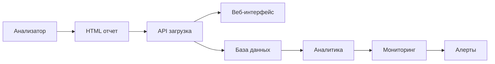

# Документация веб-платформы анализатора

## Обзор

Добро пожаловать в документацию веб-платформы анализатора! Эта система предоставляет современный веб-интерфейс для управления и анализа отчетов системного мониторинга.

### Что это такое?

Веб-платформа анализатора - это комплексное решение для:
- 📊 **Централизованного хранения** отчетов системного анализа
- 🔍 **Визуального анализа** сетевых соединений и системной активности
- 🚀 **Автоматизации** процессов загрузки и обработки отчетов
- 📈 **Мониторинга** состояния множественных систем

### Архитектура системы

```
┌─────────────────┐    ┌─────────────────┐    ┌─────────────────┐
│   Анализатор    │    │  Веб-платформа  │    │   Пользователь  │
│                 │    │                 │    │                 │
│ ┌─────────────┐ │    │ ┌─────────────┐ │    │ ┌─────────────┐ │
│ │ Сбор данных │ │───▶│ │     API     │ │◀───│ │ Веб-браузер │ │
│ └─────────────┘ │    │ └─────────────┘ │    │ └─────────────┘ │
│ ┌─────────────┐ │    │ ┌─────────────┐ │    │ ┌─────────────┐ │
│ │HTML отчеты  │ │    │ │ PostgreSQL  │ │    │ │     CLI     │ │
│ └─────────────┘ │    │ └─────────────┘ │    │ └─────────────┘ │
│                 │    │ ┌─────────────┐ │    │                 │
│                 │    │ │    Redis    │ │    │                 │
│                 │    │ └─────────────┘ │    │                 │
└─────────────────┘    └─────────────────┘    └─────────────────┘
```

## �� Быстрый старт

### 🐳 Выбор платформы контейнеризации

Веб-платформа поддерживает два варианта развертывания:

| Платформа | Рекомендуется для | Статус |
|-----------|-------------------|--------|
| **Docker Compose** | Ubuntu, Debian, общие случаи | ✅ Полная поддержка |
| **Podman Compose** | CentOS 9, RHEL 9, Fedora | ✅ Полная поддержка |

> 🔥 **Новинка!** Теперь поддерживается Podman Compose для CentOS 9 Stream и RHEL-совместимых систем!

### ⚡ Автоматический деплой

```bash
# Клонирование репозитория
git clone <repository-url>
cd analyzer/analyzer-platform

# Быстрый деплой с автоопределением платформы
chmod +x scripts/deploy-production.sh

# Docker Compose
./scripts/deploy-production.sh -p docker

# Podman Compose (рекомендуется для CentOS 9)
./scripts/deploy-production.sh -p podman

# С пересозданием контейнеров
./scripts/deploy-production.sh -p podman -f -v
```

### 1. Развертывание системы

#### Быстрая проверка готовности системы:
```bash
# Для Docker
./scripts/check-docker-deployment.sh -v

# Для Podman
./scripts/check-podman-deployment.sh -v
```

#### Ручное развертывание:
Следуйте [полному руководству по развертыванию](../analyzer-platform/DEPLOYMENT_PRODUCTION.md) для детальной настройки и развертывания веб-платформы.

### 2. Загрузка первого отчета
```bash
# Запуск анализатора с созданием HTML отчета
python3 src/analyzer.py --enhanced

# Загрузка созданного отчета
curl -X POST "http://localhost:8000/api/v1/reports/upload" \
     -F "file=@hostname_report.html"
```

### 3. Просмотр в веб-интерфейсе
Откройте http://localhost:3000 в браузере для просмотра загруженных отчетов.

## 📚 Документация

### 🛠 Для разработчиков и администраторов

#### [🚀 Продакшен развертывание](../analyzer-platform/DEPLOYMENT_PRODUCTION.md)
**Новая документация!** Полное руководство по развертыванию в продакшене:
- **Docker Compose деплой** - для универсальных систем
- **Podman Compose деплой** - для CentOS 9 Stream и RHEL 9
- **Автоматизированные скрипты** - проверка готовности и быстрый деплой
- **SELinux и безопасность** - настройка для RHEL-систем
- **SSL/TLS конфигурация** - безопасные соединения
- **Мониторинг и логи** - полный контроль системы
- **Резервное копирование** - автоматические бэкапы
- **Troubleshooting** - решение проблем

#### [📖 Руководство по развертыванию](./deployment/README.md)
Полное руководство по установке, настройке и развертыванию веб-платформы:
- **Системные требования** - минимальные и рекомендуемые характеристики
- **Быстрый старт** - развертывание за 5 минут с Docker Compose
- **Детальная установка** - пошаговая настройка всех компонентов
- **Продакшен** - настройка SSL, мониторинг, резервное копирование
- **Troubleshooting** - решение распространенных проблем

#### [🔌 API документация](./api/README.md)
Подробное описание REST API для программного взаимодействия:
- **Endpoints** - все доступные API методы с примерами
- **curl примеры** - готовые команды для терминала
- **Python примеры** - готовые скрипты для автоматизации
- **Коды ошибок** - описание всех возможных ошибок
- **Аутентификация** - настройка безопасности (в планах)

#### [💻 Примеры использования API](./api/examples.md)
Практические скрипты и сценарии использования:
- **Массовая загрузка** - скрипты для загрузки множественных отчетов
- **Мониторинг** - автоматический мониторинг состояния системы
- **Интеграция** - полная интеграция с анализатором
- **Утилиты** - полезные скрипты для администрирования

### 👥 Для пользователей

#### [🌐 Руководство по веб-интерфейсу](./web-interface/README.md)
Полное руководство пользователя по работе с веб-интерфейсом:
- **Основные функции** - загрузка, просмотр, управление отчетами
- **Детальный просмотр** - анализ соединений, портов, сетевой активности
- **Поиск и фильтрация** - эффективные способы поиска нужной информации
- **Горячие клавиши** - ускорение работы с помощью клавиатуры
- **Мобильная версия** - использование на планшетах и смартфонах
- **Troubleshooting** - решение проблем с интерфейсом

## 🔧 Сценарии использования

### Для системных администраторов

1. **Централизованный мониторинг**
   ```bash
   # Настройка автоматической загрузки отчетов каждые 30 минут
   */30 * * * * /path/to/integration.sh
   ```

2. **Анализ инцидентов**
   - Загрузка отчетов до и после инцидента
   - Сравнение сетевой активности
   - Идентификация изменений в системе

3. **Аудит безопасности**
   - Мониторинг открытых портов
   - Анализ сетевых соединений
   - Отслеживание изменений в конфигурации

### Для DevOps инженеров

1. **CI/CD интеграция**
   ```python
   # Автоматическая загрузка отчетов после деплоя
   integration = AnalyzerIntegration()
   integration.run_full_cycle()
   ```

2. **Мониторинг инфраструктуры**
   - Настройка алертов через API
   - Интеграция с системами мониторинга
   - Автоматические отчеты

### Для разработчиков

1. **API интеграция**
   ```python
   # Получение данных для custom dashboard
   response = requests.get("http://localhost:8000/api/v1/reports/stats/summary")
   stats = response.json()
   ```

2. **Кастомные утилиты**
   - Создание специализированных отчетов
   - Интеграция с внутренними системами
   - Автоматизация рутинных задач

## 🔄 Workflow интеграции

### Полный цикл автоматизации



### Пример автоматической интеграции

1. **Сбор данных**: Анализатор запускается по расписанию
2. **Создание отчета**: Генерируется HTML отчет с полной информацией
3. **Автоматическая загрузка**: Скрипт интеграции загружает отчет в API
4. **Обработка**: Система парсит данные и сохраняет в базу
5. **Уведомления**: При изменениях отправляются уведомления
6. **Визуализация**: Данные становятся доступны в веб-интерфейсе

## 📊 Возможности анализа

### Сетевая активность
- **TCP/UDP соединения** - активные соединения с детальной информацией
- **Прослушиваемые порты** - все открытые порты с описанием сервисов
- **ICMP трафик** - ping, traceroute и другая ICMP активность
- **Процессы** - привязка соединений к конкретным процессам

### Системная информация
- **Операционная система** - версия, архитектура, характеристики
- **Сетевые интерфейсы** - статистика пакетов и байтов
- **Дисковое пространство** - использование дисков и разделов
- **Установленное ПО** - Docker, PostgreSQL, другие сервисы

### Аналитика изменений
- **Временные ряды** - отслеживание изменений во времени
- **Дедупликация** - автоматическое обнаружение дубликатов
- **Сравнение отчетов** - анализ различий между снимками системы
- **Тренды** - выявление долгосрочных тенденций

## 🔒 Безопасность

### Рекомендации по безопасности

1. **Сетевая безопасность**
   - Используйте HTTPS в продакшене
   - Настройте файрвол для ограничения доступа
   - Регулярно обновляйте SSL сертификаты

2. **Данные**
   - Отчеты могут содержать чувствительную информацию
   - Настройте правильные права доступа к файлам
   - Регулярно создавайте резервные копии

3. **Аутентификация** (в планах)
   - Планируется добавление пользователей и ролей
   - OAuth интеграция
   - Audit log всех действий

## 🚨 Troubleshooting

### Быстрая диагностика

```bash
# Проверка состояния API
curl http://localhost:8000/api/v1/health

# Проверка логов (Docker)
docker-compose logs backend

# Проверка логов (Podman)
podman logs analyzer-backend-prod

# Проверка базы данных (Docker)
docker-compose exec postgres psql -U analyzer_user -d analyzer_db -c "\dt"

# Проверка базы данных (Podman)
podman exec analyzer-postgres-prod psql -U analyzer_user -d analyzer_db -c "\dt"
```

### Распространенные проблемы

| Проблема | Симптом | Решение |
|----------|---------|---------|
| API недоступен | 502/504 ошибки | Перезапуск контейнеров |
| Медленная загрузка | Таймауты | Увеличение лимитов |
| Ошибки парсинга | Неполные данные | Проверка формата HTML |
| Нет места на диске | Ошибки записи | Очистка старых отчетов |
| SELinux блокирует | Podman ошибки | Настройка контекстов |

### Получение поддержки

1. **Проверьте документацию** - большинство вопросов рассмотрены
2. **Посмотрите логи** - часто содержат полезную информацию
3. **Запустите диагностику** - используйте скрипты проверки
4. **Создайте issue** - опишите проблему с деталями
5. **Свяжитесь с командой** - для критических проблем

## 🛣 Roadmap

### Ближайшие планы (Q1-Q2 2024)

- [ ] **Аутентификация пользователей** - система логина и ролей
- [ ] **Dashboard с графиками** - визуализация трендов
- [ ] **Сравнение отчетов** - diff между снимками системы
- [ ] **Экспорт в PDF** - красивые отчеты для печати
- [ ] **Webhook уведомления** - интеграция с внешними системами
- [x] **Podman Compose поддержка** - для CentOS 9 и RHEL 9
- [x] **Автоматизированные скрипты** - проверка готовности и деплой

### Долгосрочные планы (Q3-Q4 2024)

- [ ] **Machine Learning** - автоматическое обнаружение аномалий
- [ ] **Multi-tenant** - поддержка множественных организаций
- [ ] **Mobile приложение** - нативные мобильные клиенты
- [ ] **Плагины** - система расширений
- [ ] **API v2** - расширенное API с GraphQL

## 🤝 Участие в разработке

### Для разработчиков

Мы приветствуем участие в развитии проекта! Вот как можно помочь:

1. **Код**
   - Исправление багов
   - Новые функции
   - Оптимизация производительности

2. **Документация**
   - Улучшение существующей документации
   - Перевод на другие языки
   - Примеры использования

3. **Тестирование**
   - Тестирование на разных платформах
   - Нагрузочное тестирование
   - UX/UI тестирование

### Архитектура для контрибьюторов

```
analyzer/
├── docs/                          # Документация
│   ├── api/                      # API документация
│   ├── deployment/               # Документация по развертыванию
│   ├── web-interface/            # Документация веб-интерфейса
│   └── README.md                 # Этот файл
├── analyzer-platform/            # Веб-платформа
│   ├── backend/                  # FastAPI backend
│   ├── frontend/                 # HTML/CSS/JS frontend
│   ├── scripts/                  # Скрипты развертывания
│   ├── docker-compose.prod.yml   # Docker Compose для продакшена
│   ├── podman-compose.prod.yml   # Podman Compose для продакшена
│   ├── DEPLOYMENT_PRODUCTION.md  # Продакшен документация
│   └── ...                       # Другие файлы платформы
└── src/                          # Оригинальный анализатор
    ├── analyzer.py               # Основной скрипт анализатора
    └── ...                       # Модули анализатора
```

## 📞 Контакты и поддержка

- **Документация**: Вы здесь! 📖
- **Продакшен деплой**: [DEPLOYMENT_PRODUCTION.md](../analyzer-platform/DEPLOYMENT_PRODUCTION.md)
- **API Reference**: [docs/api/README.md](./api/README.md)
- **Issues**: Создавайте в GitHub репозитории
- **Обсуждения**: GitHub Discussions для вопросов

---

**Спасибо за использование веб-платформы анализатора!** 🎉

Мы постоянно работаем над улучшением системы и будем рады вашей обратной связи. 